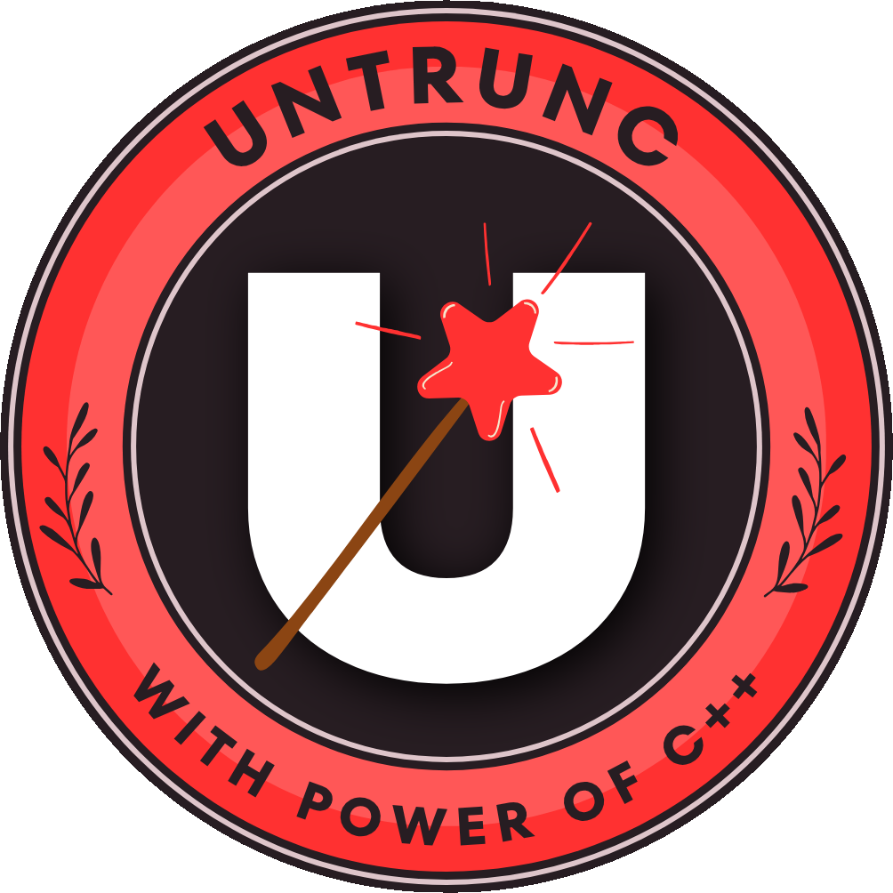

<p align="center">
  
</p>

# Untrunc

[](https://github.com/anthwlock/untrunc/actions/workflows/build.yml)
[](COPYING)

Restore a damaged (truncated, corrupt, unfinalized) **MP4, M4V, MOV, 3GP, and RSV** video file. All you need is a similar, undamaged working video file recorded from the same device / camera settings, and a little bit of luck.

---

## Table of Contents

- [About this Fork & Improvements](#about-this-fork--improvements)
- [Prebuilt Downloads](#prebuilt-downloads)
- [Usage](#usage)
  - [Command-Line (CLI)](#command-line-cli)
  - [CLI Options & Flags](#cli-options--flags)
  - [Sony RSV Video Recovery](#sony-rsv-video-recovery)
  - [Graphical User Interface (GUI)](#graphical-user-interface-gui)
- [Building from Source](#building-from-source)
  - [Ubuntu / Debian](#ubuntu--debian)
  - [Building the GUI (Linux)](#building-the-gui-linux)
  - [macOS (Homebrew)](#macos-homebrew)
  - [CentOS / RHEL / Fedora](#centos--rhel--fedora)
  - [Building with specific FFmpeg versions](#building-with-specific-ffmpeg-versions)
- [Docker](#docker)
- [Snapcraft](#snapcraft)
- [Arch Linux (AUR)](#arch-linux-aur)
- [Troubleshooting & Tips](#troubleshooting--tips)
- [Credits & Donations](#credits--donations)
- [License](#license)

---

## About this Fork & Improvements

This fork improves upon the [original untrunc by Federico Ponchio](https://github.com/ponchio/untrunc) in the following:

* **More than 10 times faster** with highly optimized parsing and atom handling.
* **Low memory usage**: fixes memory exhaustion issues on large files ([#30](https://github.com/ponchio/untrunc/issues/30#issuecomment-143744821)).
* **Large file support**: fully supports files well over **> 2 GB**.
* **Sony RSV file recovery (`-rsv-ben`)**: native recovery mode for interrupted Sony recordings (e.g. sudden power-off / battery depletion).
* **Multi-architecture prebuilt binaries**: automated CI builds for Linux (x86_64, aarch64, armv7, i386), macOS (Intel, Apple Silicon), and Windows (x64, x86).
* **Linux & Windows GUI**: graphical user interface built with libui / libui-ng and GTK+3.
* **Advanced sequence stepping (`-s`, `-st`)**: ability to skip over unknown or corrupt byte sequences to reach valid frames.
* **Audio-video sync stretch (`-sv`)**: stretch or shrink video timestamps to match audio duration.
* **Generic track support**: support for all tracks with fixed-width chunks (e.g. twos, sowt).
* **Modern codec support**: H.264 / AVC1, H.265 / HEVC (hvc1), GoPro, and Sony XAVC videos.
* **Broad FFmpeg compatibility**: compatible with modern FFmpeg releases, or compiles standalone bundled FFmpeg versions (3.3.x through 8.x).
* Many bugs fixed, actively maintained.

---

## Prebuilt Downloads

Automated, standalone binaries are available on the **[Releases](https://github.com/anthwlock/untrunc/releases/latest)** page. They come statically linked or bundled with necessary FFmpeg components — **no external FFmpeg installation is required**.

### Command-Line (CLI) Binaries

| Platform | Architecture | Release File | Notes |
|---|---|---|---|
| **Linux 64-bit** | x86_64 (Intel / AMD) | `untrunc-linux-amd64` | Standalone CLI |
| **Linux 64-bit (ARM)** | aarch64 (RPi 4/5, Asahi, AWS Graviton) | `untrunc-linux-arm64` | Standalone CLI |
| **Linux 32-bit (ARM)** | armv7 (RPi 2/3, Embedded) | `untrunc-linux-armv7` | Standalone CLI |
| **Linux 32-bit** | i386 (x86) | `untrunc-linux-i386` | Standalone CLI |
| **macOS (Apple Silicon)** | arm64 (M1 / M2 / M3 / M4) | `untrunc-macos-arm64` | Standalone CLI |
| **macOS (Intel)** | x86_64 | `untrunc-macos-x86_64` | Standalone CLI |
| **Windows 64-bit** | x86_64 | `untrunc-windows-x64.zip` | Includes CLI (`untrunc.exe`) + GUI (`untrunc-gui.exe`) + DLLs |
| **Windows 32-bit** | x86 | `untrunc-windows-x32.zip` | Includes CLI (`untrunc.exe`) + GUI (`untrunc-gui.exe`) + DLLs |

### Graphical User Interface (GUI) Binaries

| Platform | Architecture | Release File | Notes |
|---|---|---|---|
| **Linux 64-bit** | x86_64 | `untrunc-gui-linux-amd64` | Standalone GTK3 GUI executable |
| **Linux 64-bit (ARM)** | aarch64 | `untrunc-gui-linux-arm64` | Standalone GTK3 GUI executable |
| **Linux 32-bit (ARM)** | armv7 | `untrunc-gui-linux-armv7` | Standalone GTK3 GUI executable |
| **Linux 32-bit** | i386 | `untrunc-gui-linux-i386` | Standalone GTK3 GUI executable |
| **Windows 64-bit** | x86_64 | `untrunc-windows-x64.zip` | Extract and run `untrunc-gui.exe` |
| **Windows 32-bit** | x86 | `untrunc-windows-x32.zip` | Extract and run `untrunc-gui.exe` |

> **Note (Linux & macOS users):** After downloading the binary, make it executable before running:
> ```bash
> chmod +x untrunc-linux-amd64
> ./untrunc-linux-amd64 <reference.mp4> <broken.mp4>
> ```

---

## Usage

### Command-Line (CLI)

You need two files:
1. **A healthy reference video (`ok.mp4`)**: A working video recorded with the same camera / device and identical settings (resolution, framerate, codec).
2. **The corrupt video (`corrupt.mp4`)**: The damaged or unfinished recording.

Basic command:
```bash
./untrunc /path/to/reference_ok.mp4 /path/to/corrupt.mp4
```

Untrunc analyzes the healthy video to understand the container structure, scans the corrupt file for raw audio/video frames, and produces a playable fixed file named `corrupt_fixed.mp4` (or `corrupt_fixed.mov`).

---

### CLI Options & Flags

```
Usage: untrunc [options] <ok.mp4> [corrupt.mp4]
```

#### General Options
| Flag | Description |
|---|---|
| `-V`, `--version` | Display version information and exit. |
| `-n` | Non-interactive mode (suppresses prompts during interactive analysis). |

#### Repair Options
| Flag | Description |
|---|---|
| `-s` | **Step through unknown sequences**: Skips unparseable or corrupted bytes until valid headers are found. Highly recommended if a standard repair fails. |
| `-st <step_size>` | Step size in bytes used in combination with `-s` (e.g. `-st 64`). |
| `-sv` | **Stretch video**: Stretches or shrinks video timestamps to match audio duration (fixes A/V desync). |
| `-rsv-ben` | **Sony RSV Recovery**: Dedicated mode for recovering Sony `recording-in-progress` `.RSV` files (GOP-based structure recovery). |
| `-dst <path>` | Specify custom output directory or fixed destination file path. |
| `-range <A:B>` | Limit processing to a specific byte range using Python slice notation (e.g. `-range 1048576:52428800`). |
| `-skip` | Skip repair if the fixed destination file already exists. |
| `-sm` | Search for `mdat` atom even if root MP4 atom structure is missing or corrupt. |
| `-k` | Keep unknown byte sequences instead of skipping them. |
| `-dcc` | Don't check whether chunks are inside `mdat`. |
| `-dyn` | Enable dynamic chunk statistics. |
| `-noctts` | Do not restore or recalculate the `ctts` atom. |
| `-mp <bytes>` | Set maximum part size for chunk splitting. |
| `-dw` | Don't write the output `_fixed.mp4` file (dry-run). |
| `-dr` | Dump repaired tracks to separate files (implies `-dw`). |

#### Analysis & Debugging
| Flag | Description |
|---|---|
| `-i` | Show detailed media information. |
| `-it` | Display track information. |
| `-ia` | Display atom hierarchy. |
| `-is` | Display stream statistics. |
| `-a` | Run deep analysis on the reference video. |
| `-d` | Dump samples and exit. |
| `-f` | Find all atoms and verify their lengths. |
| `-lsm` | List all `mdat` and `moov` atom positions and lengths. |
| `-m <offset>` | Match and analyze file content at a specific byte offset. |
| `untrunc <ok.mp4> <ok.mp4>` | Self-check: analyzes a healthy video against itself to report discrepancies. |

#### Utility Options
| Flag | Description |
|---|---|
| `-ms` | **Make streamable**: Rearranges atoms (moves `moov` before `mdat`, like `qt-faststart`) to allow immediate playback/streaming. |
| `-sh` | Shorten file. |
| `-fsh` | Force shorten file. |
| `-u <mdat-file> <moov-file>` | Unite fragments: Combines separate `mdat` and `moov` files. |

#### Logging Options
| Flag | Description |
|---|---|
| `-q` | Quiet mode: Output only errors. |
| `-v` | Verbose output (recommended when investigating repair issues). |
| `-vv` | More verbose output. |
| `-w` | Show hidden warnings. |
| `-do` | Don't omit potential noise from output. |
| `-dec` | Display offsets in decimal rather than hexadecimal. |

---

### Sony RSV Video Recovery

When a Sony camera abruptly loses power or its battery is pulled during recording, it leaves behind an `.RSV` file without finalized MP4 headers.

To repair Sony `.RSV` files, use the `-rsv-ben` recovery mode:

```bash
./untrunc -rsv-ben reference_from_same_camera.mp4 corrupt_file.RSV
```

> **Note:** `-rsv-ben` auto-detects GOP length and Sony RTMD packets. It is not compatible with `-s`, `-k`, or `-dyn`.

---

### Graphical User Interface (GUI)

If you prefer a visual interface, you can run the GUI:

- **Windows**: Run `untrunc-gui.exe` (included in `untrunc-windows-x64.zip` / `untrunc-windows-x32.zip`).
- **Linux**: Run `./untrunc-gui-linux-amd64` (or the binary matching your CPU architecture).

You can also pass video files directly to the GUI via the command line:
```bash
./untrunc-gui /path/to/reference_ok.mp4 /path/to/corrupt.mp4
```

The GUI consists of four tabs:
1. **Repair**: Select reference and corrupt videos, adjust common settings, and view real-time log output and progress.
2. **Settings**: Configure logging verbosity, sequence stepping, and streamable output.
3. **Analyze**: Inspect tracks, atoms, and media structure.
4. **About**: Version information and credits.

---

## Building from Source

### Ubuntu / Debian

#### Method A: Using system FFmpeg libraries (Fastest)
```bash
sudo apt-get update
sudo apt-get install -y libavformat-dev libavcodec-dev libavutil-dev g++ make git
git clone https://github.com/anthwlock/untrunc.git
cd untrunc
make IS_RELEASE=1
sudo cp untrunc /usr/local/bin/
```

#### Method B: Standalone build with dedicated FFmpeg (Recommended)
The Makefile can automatically download, configure, and compile a specific FFmpeg version locally:
```bash
sudo apt-get update
sudo apt-get install -y yasm wget g++ make xz-utils git
git clone https://github.com/anthwlock/untrunc.git
cd untrunc
make FF_VER=3.3.9 IS_RELEASE=1
sudo cp untrunc /usr/local/bin/
```

---

### Building the GUI (Linux)

To compile `untrunc-gui`, you need GTK+3 and `libui` (or `libui-ng`):

```bash
sudo apt-get update
sudo apt-get install -y libgtk-3-dev pkg-config g++ make
```

If you have `libui` or `libui-ng` installed in `/usr/local`:
```bash
make untrunc-gui FF_VER=3.3.9 IS_RELEASE=1 LIBUI_STATIC=1 EXTRA_LDFLAGS="$(pkg-config --libs gtk+-3.0)"
```

---

### macOS (Homebrew)

```bash
brew install nasm wget ffmpeg
git clone https://github.com/anthwlock/untrunc.git
cd untrunc

# Build with local FFmpeg 3.3.9:
make FF_VER=3.3.9 IS_RELEASE=1

# Or build using Homebrew's installed FFmpeg:
CPPFLAGS="-I$(brew --prefix)/include" LDFLAGS="-L$(brew --prefix)/lib" make IS_RELEASE=1
```

---

### CentOS / RHEL / Fedora

```bash
sudo yum -y install epel-release
sudo yum -y install git gcc-c++ yasm make wget xz
git clone https://github.com/anthwlock/untrunc.git
cd untrunc
make FF_VER=3.3.9 IS_RELEASE=1
sudo cp untrunc /usr/local/bin/
```

---

### Building with specific FFmpeg versions

The Makefile includes convenient shorthand targets for compiling against specific FFmpeg releases:

```bash
make untrunc-33   # Builds with FFmpeg 3.3.9 (Classic & rock solid)
make untrunc-34   # Builds with FFmpeg 3.4.5
make untrunc-41   # Builds with FFmpeg 4.1
make untrunc-60   # Builds with FFmpeg 6.0
make untrunc-70   # Builds with FFmpeg 7.0
make untrunc-71   # Builds with FFmpeg 7.1
make untrunc-80   # Builds with FFmpeg 8.0
make untrunc-81   # Builds with FFmpeg 8.1
```

> **FFmpeg 8.1+ Note:** For FFmpeg versions > 8.1, struct definition mismatches can occur if upstream changes the internal `FFCodec` struct, potentially leading to undefined behavior (see [src/ff_internal.h](src/ff_internal.h)). Sticking to FFmpeg 3.3.9 or the prebuilt binaries is recommended for maximum compatibility.

---

## Docker

You can build and execute Untrunc inside an isolated Docker container without installing any dependencies on the host:

```bash
# Build the Docker image (optionally pass --build-arg FF_VER=3.3.9)
docker build -t untrunc .
docker image prune --filter label=stage=intermediate -f

# Run untrunc by mounting your video directory to /mnt
docker run --rm -v ~/Videos:/mnt untrunc /mnt/reference_ok.mp4 /mnt/corrupt.mp4
```

---

## Snapcraft

If you use Ubuntu or another distribution with Snap enabled:

```bash
sudo snap install --edge untrunc-anthwlock
untrunc-anthwlock /path/to/ok.mp4 /path/to/broken.mp4
```

[](https://snapcraft.io/untrunc-anthwlock)

---

## Arch Linux (AUR)

Untrunc is available in the Arch User Repository:
- Package: [`untrunc-anthwlock-bin`](https://aur.archlinux.org/packages/untrunc-anthwlock-bin)

```bash
# Using an AUR helper:
paru -S untrunc-anthwlock-bin
# or
yay -S untrunc-anthwlock-bin

# Manual installation:
git clone https://aur.archlinux.org/untrunc-anthwlock-bin.git
cd untrunc-anthwlock-bin
makepkg -si
```

---

## Troubleshooting & Tips

1. **"Could not find any atoms / mdat"**:
   - Try adding `-sm` to force scanning for raw `mdat` video data:
     ```bash
     ./untrunc -sm ok.mp4 corrupt.mp4
     ```
2. **Corrupted or partially damaged stream**:
   - Use `-s` (step through unknown sequences) to jump over bad sectors:
     ```bash
     ./untrunc -s ok.mp4 corrupt.mp4
     ```
   - You can fine-tune the step resolution with `-st <bytes>` (e.g. `-st 64`).
3. **Audio and video are out of sync**:
   - Use `-sv` to stretch/shrink video timestamps to match the audio duration:
     ```bash
     ./untrunc -sv ok.mp4 corrupt.mp4
     ```
4. **Sony RSV file**:
   - If the file has a `.RSV` extension, use:
     ```bash
     ./untrunc -rsv-ben ok.mp4 corrupt.RSV
     ```
5. **Detailed diagnostics**:
   - Run with `-v` or `-vv` to inspect detailed chunk and atom parsing logs.
6. **Reference video requirement**:
   - The reference file **must** come from the identical camera model, firmware, resolution, codec, and framerate settings. If the parameters differ, the video/audio decoder tables cannot map properly.

---

## Credits & Donations

- **Federico Ponchio**: Original author of [untrunc](https://github.com/ponchio/untrunc). (You can support Federico via [his donation link](https://github.com/ponchio/untrunc#helpsupport)).
- **anthwlock**: Fork author, significant performance optimizations, fast atom parsing, and 2GB+ support. (Donations: [anthwlock PayPal](https://www.paypal.me/anthwlock)).
- **Ben / Contributors**: Sony RSV file recovery structure parsing and multi-architecture build enhancements.
- **fr0stb1rd**: Multi-architecture CI/CD pipeline, prebuilt Linux GUI packages, and **project logo design**.

---

## License

- **Source Code**: Licensed under the **GNU General Public License v2 (GPL-2.0)**. See the [COPYING](COPYING) and [LICENSE](LICENSE) files for details.
- **Logo & Artwork**: The Untrunc logo ([assets/untrunc-logo.png](assets/untrunc-logo.png)) was designed and created by **fr0stb1rd** and is licensed under the [Creative Commons Attribution 4.0 International (CC BY 4.0)](https://creativecommons.org/licenses/by/4.0/) license.
